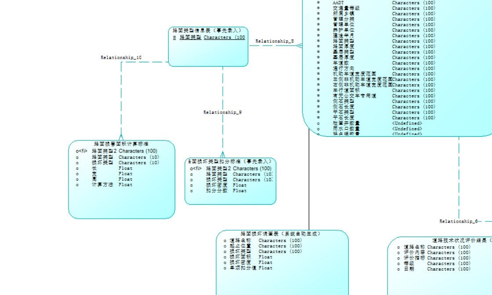

# road_info_manage
轻量级城镇道路养护信息管理系统设计与实现

# 演示地址 www.xgsjg.top

账号：`admin`

密码：`123`

## 运行步骤

node版本 `v10.15.3`

npm版本 `6.4.1`

mysql版本 8.0

创建gl数据库，导入gl.sql文件

在‘前端’和后端目录下分别 打开cmd 运行 `npm install` 安装必要的库文件，下载完成后前后端分别运行`npm run dev`命令

打开浏览器 如何 `localhost://8080`即可运行成功

# 系统分析

## 第一章 引言

### 1.1编写目的

本系统名字为城镇道路养护信息管理系统，开发的目的是为了建立一套科学、完善、智能，便捷的路面管理系统。代替传统的以人工为主的道路养护管理，结合地理信息技术为政府提供有效的、直观的管理手段，并根据计算机强大的记忆和计算功能为决策人员提供辅助建议，提高决策水平。

### 1.2背景

经过三十多年的快速发展，我国在道路与公路建设领域取得了辉煌的成果，到目前已经基本形成了以高速公路、一级公路为主干，其他等级公路相互连通的交通网络，为我国经济发展提供了牢固的基础支撑。过去的工作重心主要在道路与公路建设以及路网扩展上，但思想观念落后，过分强调建设，轻视并忽略了养护维修在整个工程项目寿命周期的作用。如今大量已建工程到了使用寿命末期，而整个交通行业中开展新建项目的需求放缓，发展重心逐渐由建设扩展向养护维

修转移。而传统的道路养护管理手段落后，数据采集和传输方式仍以人工为主，造成人力资源的大量浪费及出错概率增大。传统以纸质或电子文档为主的数据管理和存储方式不能适应海量数据的涌入。在这样一个背景下开发的该道路养护信息管理系统。

### 1.3参考资料

[1]魏密, 周智密, 禤炜安. 基于GIS路面养护管理信息系统框架研究[J]. 城市地理┿城乡规划, 2019(2):70-74.

[2]吴赞阳. 基于GIS的南京市城市道路养护管理系统的研究与开发[D]. 东南大学, 2006.

[3]秦明. 基于GIS的沥青路面预防性养护研究[D]. 2014.

[4]何政. 基于GIS的城市道路路面养护辅助决策系统的研究与开发[D].

### 1.4术语定义及说明

城镇道路的养护应包括道路设施的检查评价、养护工程和技术档案管理；根据各类道路在城镇中的重要性，将城镇道路分为下列三个养护等级：Ⅰ等养护的城镇道路：快速路、主干路、广场、商业繁华街道、重要生产区道路、外事活动路线、游览路线；Ⅱ等养护的城镇道路：除Ⅰ等养护以外的次干路、步行街、支路中的商业街道；Ⅲ等养护的城镇道路：除Ⅰ、Ⅱ等养护以外的支路。

城镇道路应根据养护等级和技术状况进行养护和评价。城镇道路的技术状况评价应分为四级：A-优、B-良、C-合格、D-不合格。城镇道路应定期进行日常巡查、检测评价，并应根据评价结果制定年度维修计划及中期道路养护规划。城镇道路养护工程应根据其工程性质和技术状况分为预防性养护、矫正性养护、应急性养护。矫正性养护包括保养小修、中修、大修和改扩建工程，中修、大修和改扩建工程应进行专项设计。

## 第二章 项目环境概述

### 2.1系统描述

本系统将地图与数据库连通，道路信息以地图的形式直观的显示，可以快速查询、浏览道路信息。各式各样的表单方便系统收集信息，并采用数据库规范性约束对不合格的数据不录入本系统，大大提高了数据的准确性。最后通过写入系统的各种计算标准、公式进行计算，对录入本系统的道路评估、生成可视化统计信息， 使用户清楚地了解道路的养护情况。

### 2.2系统总体功能要求描述

#### 2.3.1数据范围

本系统基于mysql数据库，数据的表示范围也与mysql表示的数据范围有关

| Data  type | Range                                                        | Storage                    |
| ---------- | ------------------------------------------------------------ | -------------------------- |
| bigint     | -2^63  (-9,223,372,036,854,775,808) to 2^63-1 (9,223,372,036,854,775,807) | 8 Bytes                    |
| int        | -2^31  (-2,147,483,648) to 2^31-1 (2,147,483,647)            | 4 Bytes                    |
| smallint   | -2^15  (-32,768) to 2^15-1 (32,767)                          | 2 Bytes                    |
| tinyint    | 0 to 255                                                     | 1 Byte                     |
| decimal    | - 10^38  +1 through 10^38 - 1                                |                            |
| numeric    | - 10^38  +1 through 10^38 - 1                                |                            |
| float      | -  1.79E+308 to -2.23E-308, 0 and 2.23E-308 to 1.79E+308     | Depends  on the value of n |
| real       | - 3.40E + 38 to -1.18E - 38, 0 and 1.18E  - 38 to 3.40E + 38 | 4  Byes                    |
| money      | -922,337,203,685,477.5808  to 922,337,203,685,477.5807       | 8 bytes                    |
| smallmoney | - 214,748.3648  to 214,748.3647                              | 4 bytes                    |

#### 2.3.2时间范围

因为本系统需要养路段历史数据进行对道路总体评估，所以以往的纸制记录表或者电脑存档都可以移植到该道路养护管理信息系统，以便更精准的进行分析评估。

### 2.4.系统环境

#### 2.4.1硬件环境

\1. CPU:奔腾3(P IID)以上配置(推荐奔腾4以上配置)。

2.内存:128 兆以上(推荐 256 兆以上)。

3.操作系统：:Windows 2000 以上版本(推荐Windows XP SP2以上版本)。4.浏览器:IE5.5 以上版本(推荐 IE6.0版本)。

#### 2.4.2软件环境

1.安装编译软件:VsCode

2.安装node.js 10.15.3版本以上，安装完成后打开Windos shell命令窗口，使用npm install安装express框架

3.安装操作mysql可视化软件，XAMPP，配置端口为8080

4.导入vue.js环境，到Vue官网https://cn.vuejs.org/ 下载vue.js文件引入本系统。

#### 2.4.3网络环境

本系统采用B/S架构，并部署到服务器端，在没有网络的时候也可以采用本地html的方式进行访问。

### 2.5系统用户角色区分

### 2.6 一般约束

本系统底层数据库采用MySQL开发， 如果使用大量存储过程，那么使用这些存储过程的每个连接的内存使用量将会大大增加，在存储过程中过度使用大量逻辑操作，则CPU使用率也会增加。本系统的前端开发采用Vue的架构，Vue是一个渐进式的javascript开发框架，通过组件的开发，最后进行组件的组合，合并组件形成页面。可以说是时下最流行的前端开发框架，然而Vue也有一些约束，例如生态系统不够完善、报错不明显等。中间层通过express框架来实现对数据访问获取，而不是通过直接利用原生Node进行访问，这样有助与系统的移植性和优良性。最后总体软件是基于轻量级的城镇道路养护，数据量不太大，属于对中小型项目，且只能对道路进行数据收集、计算、分析、评估。而无法接受桥梁、高速公路、立交桥等其他城市设施的信息。

## 第三章 成本效益分析

本系统的数据数据管理、存储在计算机上进行，极大降低了人工的成本，利用数据库主键约束、检查约束、用户自定义约束等技术对录入本系统的数据进行检查，如果不符合规范则将会报错。这方面降低了数据记录错误的风险，保证分析决策人员的政策最大限度的不出差错，辅助决策系统也可以降低决策成本，避免不必要的损失。开发本系统的成本需要雇用专业开发人员、数据库开发人员等

## 第四章 时间进度安排

## 第五章 系统业务流程分析

## 第六章 软件需求描述

 

## 第七章 非功能需求描述

| **需求**             | **描述**                                                     |
| -------------------- | ------------------------------------------------------------ |
| **初始数据质量标准** | 不符合期望的数据较少，数据完备性高、道路基本数据由网络爬取与一致性较低 |
| **可用性**           | 本系统采用可视化数据操作，结合GIS技术展示道路信息可用性较好，易上手。 |
| **性能**             | 基于MySQL数据库技术，可以存储海里数据，数据处理的效率也很快且准确，总体来说性能较好 |
| **可移植性**         | 本系统使用B/S架构，只需系统配置node，MySQL的环境无其他特殊环境变量要求，在window、linux平台均能运行，移植性好。 |
| **可扩展性**         | 基于Vue框架的前端界面虽然性能好，简单易用单拓展性使其为数不多的的缺点 |
| **可维护性**         | 本系统设计时采用前后端分离思路进行开发，当系统出现问题之后只需确定那个模块，可以快速维护。 |

# 系统设计

## 第一章 功能架构

## 第二章 数据架构设计

### 2.1 概念模型

### 2.2 逻辑模型

### 2.3 物理模型

## 第三章 其它架构

采用B/S架构浏览器端：即用户使用的浏览器，是用户操作系统的接口，用户通过浏览器界面向服务器端提出请求，并对服务器端返回的结果进行处理并展示，通过界面可以将系统的逻辑功能更好的表现出来。

服务器端：提供数据服务，操作数据，然后把结果返回中间层，结果显示在系统界面上。中间件：这是运行在浏览器和服务器之间的。这层主要完成系统逻辑，实现具体的功能，接受用户的请求并把这些请求传送给服务器，然后将服务器的结果返回给用户，浏览器端和服务器端需要交互的信息是通过中间件完成的。

## 第四章 开发及管理工具

开发框架：B/S开发架构

前端：html+css+vue.js；高德地图API调用

链接语言：node.js连接

后端：MySQL；XAMPP操作MySQL
